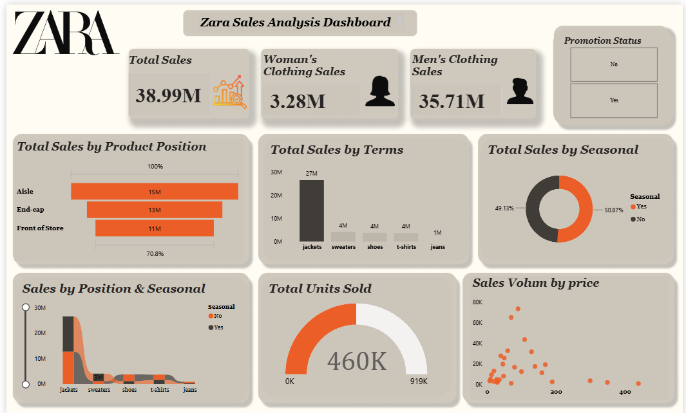

# 🛍️ Zara Sales Analysis Dashboard

An interactive **Power BI dashboard** created to analyze Zara sales data and provide clear insights into sales performance, products, pricing, promotions, and product positioning.

## 📊 Dashboard Preview

## 🎯 Project Objective

The goal of this project is to transform Zara sales data into an interactive and visually appealing dashboard that helps understand sales performance and identify important business insights.

The dashboard focuses on:

- Total Sales
- Sales by Product
- Sales by Product Position
- Sales by Seasonal Promotion
- Total Units Sold
- Sales Volume by Price
- Promotion Status

## 🎨 Design Process

Before building the dashboard in Power BI, I created the initial dashboard design and layout using **Figma**.

The Figma design was used as a visual reference to plan:

- Dashboard layout
- KPI cards
- Charts and visualizations
- Filters
- Overall visual structure

The final design was then implemented in **Power BI** as an interactive dashboard.

## 🛠️ Tools & Technologies

- **Power BI**
- **Power Query**
- **DAX**
- **Figma**

## 🧹 Data Preparation

The data was prepared and transformed using **Power Query** before creating the dashboard.

The preparation process included cleaning the dataset and transforming the required data to make it suitable for analysis and visualization.

## 📈 Dashboard Highlights

### KPI Cards

- **Total Sales:** 38.99M
- **Women's Clothing Sales:** 3.28M
- **Men's Clothing Sales:** 35.71M
- **Total Units Sold:** 460K

### Visualizations

The dashboard includes:

- **Total Sales by Product Position**
- **Total Sales by Terms**
- **Total Sales by Seasonal**
- **Sales by Position & Seasonal**
- **Total Units Sold**
- **Sales Volume by Price**
- **Promotion Status**

## 🔍 Key Insights

- Men's clothing contributes the largest share of the displayed sales.
- Jackets have the highest sales among the displayed product terms.
- Aisle has the highest sales among the product positions shown.
- Seasonal and non-seasonal sales are distributed relatively evenly.
- The dashboard provides a clear view of the relationship between sales, pricing, product position, and promotions.

## 💡 Skills Demonstrated

- Data Cleaning & Transformation
- Power Query
- DAX
- Data Visualization
- Dashboard Design
- Business Intelligence
- Power BI
- Figma UI Design
